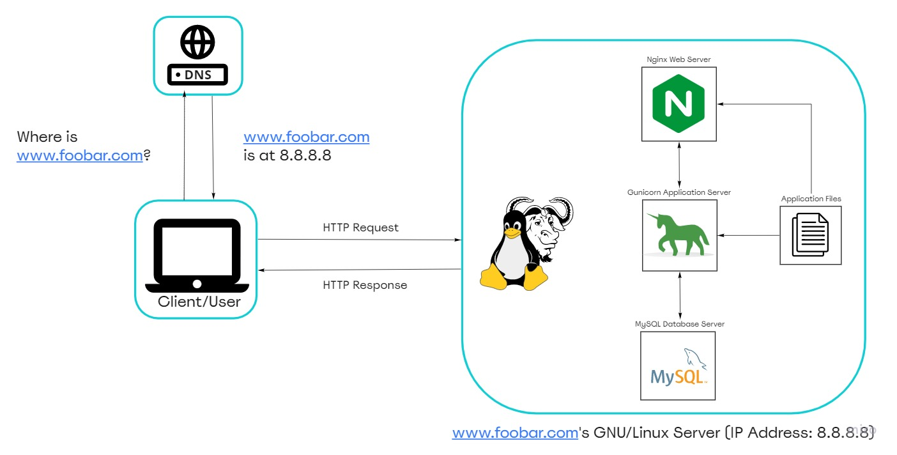

# Simple Web Stack

## Description

This basic web infrastructure hosts a website accessible through the domain www.foobar.com. However, it's essential to note that the current setup lacks firewalls or SSL certificates for network protection. Moreover, the components, including the database and application server, share the available resources, such as CPU, RAM, and SSD, provided by the server.

## Specifics About This Infrastructure
 + Server Definition: 
   A server refers to either computer hardware or software designed to offer services to other computers, commonly known as clients.

 + Domain Name Purpose: 
   The domain name serves as a user-friendly alias for an IP Address. For instance, www.wikipedia.org is more recognizable and memorable than its corresponding numerical IP address, 91.198.174.192. The DNS (Domain Name System) maintains the mapping between domain name aliases and IP addresses.

 + DNS Record Type for www in www.foobar.com: 
   The domain www.foobar.com utilizes an A record. You can verify this using the dig www.foobar.com command. 
   Note: The results may vary, but for the infrastructure in this design, an A record is employed. 
  <i>An Address Mapping record (A Record) stores a hostname and its corresponding IPv4 address.</i>

 + Web Server Function: 
   The web server is responsible for handling requests via HTTP or secure HTTP (HTTPS) and responding with the content of the requested resource or an error message.

 + Application Server Role: 
   The application server's primary function is to install, operate, and host applications and related services for end users, IT services, and organizations. It facilitates the hosting and delivery of high-end consumer or business applications.

 + Database Purpose: 
   The database's role is to maintain an organized collection of information that can be easily accessed, managed, and updated.

 + Communication between Server and Client: 
   The server communicates with the client's computer (user requesting the website) through the internet network using the TCP/IP protocol suite. This enables the exchange of data and information between the two entities.

## Issues With This Infrastructure
 + This web infrastructure exhibits several instances of Single Points of Failure (SPOF), which could lead to significant issues:
   SPOF Examples: 
   For instance, the MySQL database server being unavailable would cause the entire website to be inaccessible.

 
 + Downtime during Maintenance: 
   Whenever maintenance checks are required for any component, they have to be taken offline, or the entire server needs to be powered off. Given the presence of only one server, this maintenance downtime would result in the website being unavailable.

 + Limited Scalability with High Incoming Traffic: 
   The current infrastructure faces challenges in scaling since all the required components reside on a single server. As a result, the server can quickly deplete resources or slow down significantly when experiencing a high influx of requests.

+ There are multiple SPOF (Single Point Of Failure) in this infrastructure. For example, if the MySQL database server is down, the entire site would be down.

+ Downtime when maintenance needed. When we need to run some maintenance checks on any component, they have to be put down or the server has to be turned off. Since there's only one server, the website would be experiencing a downtime.

+ Cannot scale if there's too much incoming traffic. It would be hard to scale this infrastructure becauses one server contains the required components. The server can quickly run out of resources or slow down when it starts receiving a lot of requests.
